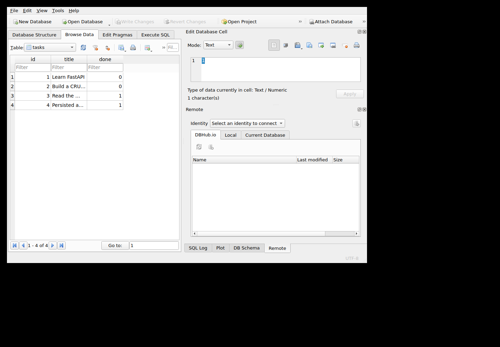

# FlyRank Backend Assignment 2 — Connect CRUD to Database

This repository is the AI-generated Assignment 2 implementation. It keeps the Assignment 1 task API contract unchanged while replacing in-memory storage with SQLite persistence.

## Run from a clean clone

Requires Python 3.13+.

```bash
python -m venv .venv
python -m pip install .
python -m uvicorn app.main:app --app-dir flyrank_assignment_2 --host 127.0.0.1 --port 8000
```

Swagger UI: `http://localhost:8000/docs`

By default the database file is `flyrank_assignment_2/data/tasks.sqlite3`. Override it with `TASK_DATABASE_PATH=/path/to/tasks.sqlite3`.

## Assignment contract

The external API remains the same as Assignment 1:

| Method | Route | Success | Failure |
|---|---|---:|---|
| GET | `/` | 200 | — |
| GET | `/health` | 200 | — |
| GET | `/tasks` | 200 | — |
| GET | `/tasks/{id}` | 200 | 404 |
| POST | `/tasks` | 201 | 400 |
| PUT | `/tasks/{id}` | 200 | 400 / 404 |
| DELETE | `/tasks/{id}` | 204 | 404 |

The storage implementation is SQLite. The `tasks` table is created automatically. Exactly three starter tasks are inserted only when the table is empty. All dynamic SQL values are parameterized.

## Executed persistence evidence

The final GitHub Actions verification used a fresh SQLite file and two separate Uvicorn processes. The first process started with exactly three seeded tasks, created task `4`, and updated it. After that process was stopped, a new process started against the same database file. The recorded result was:

```text
Initial seeded row count: 3
Created/updated task id: 4
Row count after restart: 4
Persisted row after restart:
{"id":4,"title":"Persisted and updated","done":true}
Result: PASS
```

See [`docs/persistence-check.txt`](docs/persistence-check.txt) for the committed checkpoint.

The verification also queried the SQLite database directly:

```sql
SELECT id, title, done FROM tasks ORDER BY id;
```

Observed rows:

```text
id  title                  done
--  ---------------------  ----
1   Learn FastAPI          0
2   Build a CRUD API       0
3   Read the assignment    1
4   Persisted and updated  1
```

See [`docs/sql-query.txt`](docs/sql-query.txt) for the committed query/output.

## DB Browser inspection

The same verification database was opened in **DB Browser for SQLite**. The screenshot below is committed from that executed verification run.



## Tests and acceptance gate

```bash
python -m pytest -q
```

The suite covers CRUD compatibility, validation, seed-on-empty behavior, parameterized-query safety, persistence across separate Uvicorn processes, deletion persistence, and non-duplicate seeding.

The acceptance workflow in [`.github/workflows/a2-evidence.yml`](.github/workflows/a2-evidence.yml) performs a clean package install, runs the suite, proves restart persistence against a fresh database, executes the direct SQL inspection, opens DB Browser for SQLite under a virtual display, captures the screenshot, and uploads the evidence artifact.

The detailed implementation notes and earlier verification record remain in [`flyrank_assignment_2/README.md`](flyrank_assignment_2/README.md) and [`flyrank_assignment_2/VERIFICATION.md`](flyrank_assignment_2/VERIFICATION.md).

## Scope

This assignment deliberately uses SQLite. Docker/PostgreSQL containerization belongs to Assignment 3 and is not claimed here.
